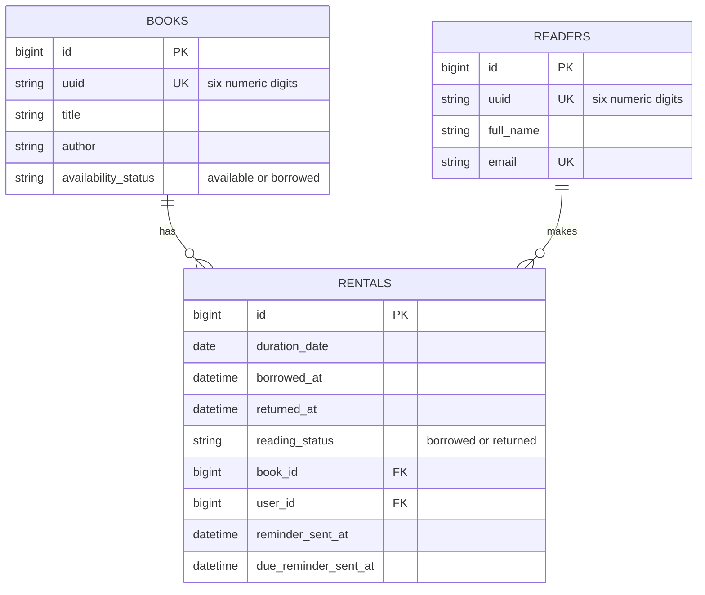

# Coffee Books

## Run with Docker

Start the Rails application and PostgreSQL database:

```sh
docker compose up --build
```

The application is available at http://localhost:3000. Rails runs database
preparation automatically when the web container starts. Development seeds
are loaded automatically when no books or readers exist, and are skipped on
later starts once the database has data.

Run Rails commands in the web container:

```sh
docker compose run --rm web ./bin/rails console
docker compose run --rm web ./bin/rspec
```

Stop the containers with `docker compose down`. Add `-v` to that command when
you also want to remove the PostgreSQL and Bundler volumes.

## Run without Docker

The project uses Ruby 4.0.6 and PostgreSQL. Install dependencies with
`bundle install`, create the database with `bin/rails db:prepare`, and start
Rails with `bin/rails server`.

## Database Models



`books.id`, `readers.id`, and `rentals.id` are normal database-generated
primary keys. `books.uuid` and `readers.uuid` are unique six-digit public
identifiers generated by the models; they are separate from internal foreign
keys.

Status values are defined with Active Record enums:

- `Book#availability_status`: `available` or `borrowed`
- `Rental#reading_status`: `borrowed` or `returned`

Indexes support public identifier lookups, unique reader emails, book and
reader rental history, active rental queries, and due-date queries. A partial
unique index allows only one active rental per book.
